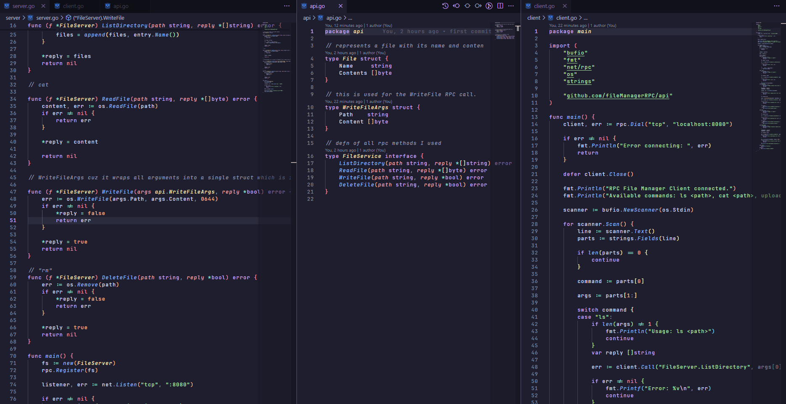
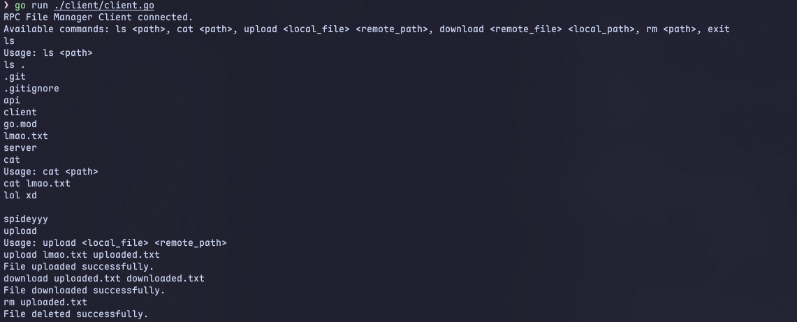

### **File Manager RPC**

This repository contains a simple file manager built using Go's standard RPC library. It provides a client-server architecture for performing basic file operations remotely.

-----

### **Overview**

The Go File Manager RPC is a command-line application that allows users to interact with a remote file system over a network using a **Remote Procedure Call (RPC)** mechanism. The project is divided into a server component, which exposes the file management functionalities, and a client component, which provides an interactive interface for users to execute commands.

-----

### **Architecture**

The project follows a client-server model based on TCP networking and Go's `net/rpc` package.

  * **Server:** The server is responsible for handling all file operations. It registers a `FileServer` struct with the RPC system, making its methods available for remote invocation. It listens for incoming TCP connections on a specified port (8080) and accepts RPC requests from clients.
  * **Client:** The client connects to the server and provides a command-line interface for the user. It translates user commands like `ls` or `cat` into RPC method calls to the server, which then performs the requested action.
  * **API:** A separate `api` package defines the data structures and interfaces used for communication between the client and the server, ensuring a consistent contract for RPC calls.

<br>



<br>

-----

<br>

-----

### **How It Works**

1.  **Server Startup:** The server starts and listens on a TCP port.
2.  **Client Connection:** The client connects to the server using `rpc.Dial`.
3.  **Command Execution:** The user enters a command on the client's console (e.g., `ls /home`).
4.  **RPC Call:** The client's `main` function parses the command and uses `client.Call` to invoke the corresponding method on the server (e.g., `FileServer.ListDirectory`). The arguments are serialized and sent over the network.
5.  **Server Execution:** The server receives the RPC request, deserializes the arguments, and executes the requested method (e.g., `os.ReadDir`).
6.  **Response:** The server sends the result back to the client, which then prints the output to the console.

-----

### **Usage**

To run the application, you need to have Go version `1.25.0` or higher installed.

1.  **Start the server:**

    ```bash
    go run server/server.go
    ```

    The server will start and print **"Server listening on port 8080"**.

2.  **Run the client:**
    In a separate terminal, run the client.

    ```bash
    go run client/client.go
    ```

    The client will connect to the server and display the available commands.

    

<br>

-----

<br>

**Available Commands:**

  * `ls <path>`: Lists the contents of a directory.
  * `cat <path>`: Reads and prints the content of a file.
  * `upload <local_file> <remote_path>`: Uploads a local file to the remote server.
  * `download <remote_file> <local_path>`: Downloads a remote file to your local machine.
  * `rm <path>`: Deletes a file on the server.
  * `exit`: Closes the client application.

-----

### **Use Cases**

  * **Remote Administration:** Manage files on a remote machine without needing to use SSH or other complex protocols.
  * **Simple Distributed Systems:** Provide a basic file-sharing service within a small network.
  * **Educational Tool:** A hands-on example for learning Go's RPC mechanism and client-server architecture.